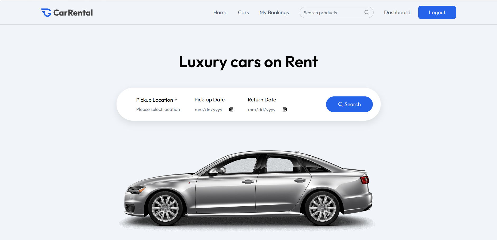
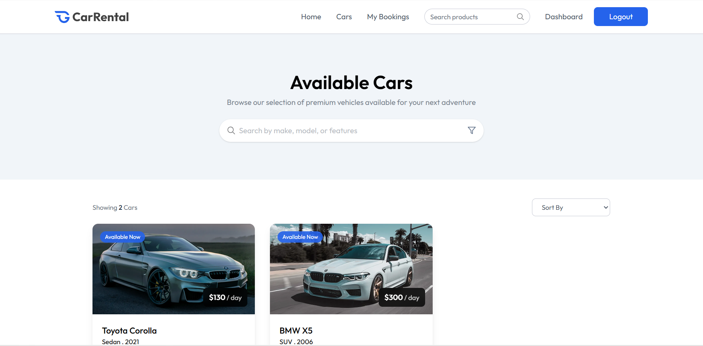
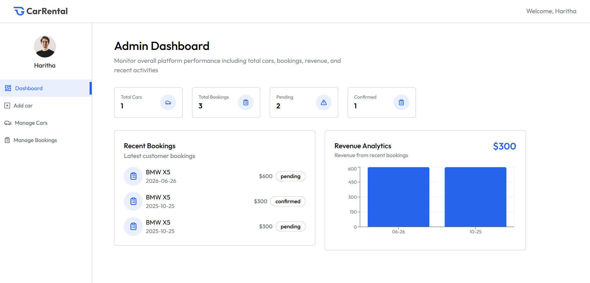
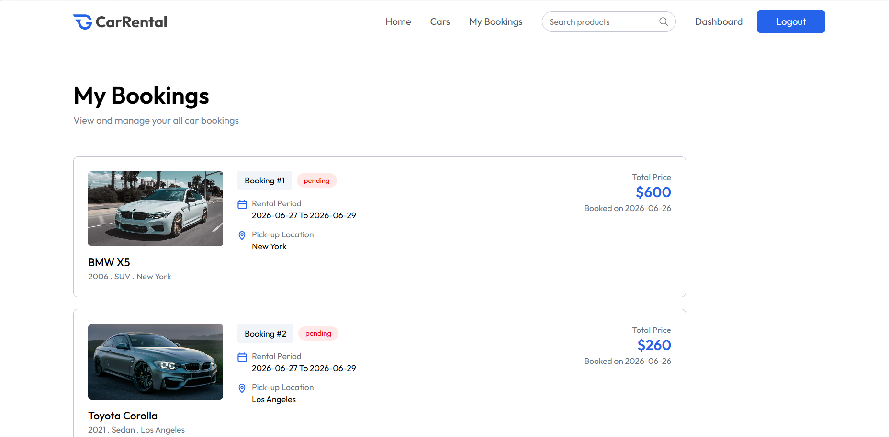

# 🚗 CarRental - MERN Stack Application

A full-featured car rental platform with role-based dashboards, real-time availability checking, booking management, and image optimization.

> **Note:** The foundation of this project was initially built by following a YouTube tutorial. After completing the tutorial, I independently refactored and enhanced the application with additional security, performance, UI/UX, and architectural improvements.

---

## ✨ My Enhancements & Improvements

The following features and improvements were independently implemented after completing the initial tutorial-based version.

### 🔒 Security & Architecture

* Implemented a `ProtectedRoute` wrapper to secure user-specific routes at the frontend routing level.
* Added API rate limiting using `express-rate-limit` to help protect authentication endpoints from excessive requests.
* Added client-side and server-side date validation to prevent invalid booking dates.
* Cleaned up unused and commented-out code and standardized code comments.

### ⚡ Performance Optimization

* Resolved an **N+1 database query problem** in the booking availability API by using MongoDB's `$in` operator and a JavaScript `Set` for efficient lookups.
* Implemented **Optimistic UI Updates** for the car availability toggle, allowing the interface to respond immediately while the server processes the request.
* Created a reusable **custom `useDebounce` hook** to reduce unnecessary processing during search input.
* Implemented automatic **scroll-to-top behavior** when navigating between routes.

### 🎨 UI/UX & Responsiveness

* Redesigned the Owner Dashboard with a **mobile-responsive slide-out drawer**, overlay, and floating action button.
* Extracted reusable `Input` and `Select` components following the **DRY principle**.
* Added sorting options to the Cars listing page:

  * Price: Low to High
  * Price: High to Low
  * Newest
* Added loading indicators and empty-state UI to important pages such as My Bookings and Cars.
* Added a custom **404 Not Found** page for invalid routes.
* Persisted search dates using `localStorage` so users can retain their search information when navigating between pages.

---

## 🛠️ Tech Stack

| Frontend      | Backend            | Database | Storage & Services |
| ------------- | ------------------ | -------- | ------------------ |
| React         | Node.js            | MongoDB  | ImageKit           |
| Vite          | Express.js         | Mongoose | Multer             |
| Tailwind CSS  | JWT Authentication |          |         |
| Framer Motion | Express Rate Limit |          |                    |
| Recharts      | REST API           |          |                    |

---

## 🏗️ Application Features

* 👤 User authentication
* 🔐 Protected routes
* 🚗 Car browsing and search
* 📅 Car booking
* 🔎 Real-time booking availability checking
* 👨‍💼 Owner dashboard
* 🚘 Car management
* 📊 Dashboard analytics
* 📱 Responsive UI
* 🖼️ Image upload and optimization
* 🔒 API rate limiting
* ⚡ Optimistic UI updates
* 🔄 Persistent search state

---

## 📸 Screenshots

<table>
  <tr>
    <td>
      
    </td>
    <td>
      
    </td>
  </tr>
  <tr>
    <td align="center">
      <b>Home Page</b><br>
      Browse and search available vehicles
    </td>
    <td align="center">
      <b>Car Listing</b><br>
      Filter and sort available vehicles
    </td>
  </tr>
  <tr>
    <td>
      
    </td>
    <td>
      
    </td>
  </tr>
  <tr>
    <td align="center">
      <b>Owner Dashboard</b><br>
      Manage vehicles and rental operations
    </td>
    <td align="center">
      <b>My Bookings</b><br>
      View and manage rental bookings
    </td>
  </tr>
</table>

---

## 🚀 Getting Started

### Prerequisites

* Node.js 18+
* MongoDB database
* ImageKit account

### 1. Clone the Repository

```bash
git clone https://github.com/Haritha-cel/car-rental-mern.git
cd Car_Rental
```

### 2. Setup Backend

```bash
cd server
npm install
```

Create a `.env` file inside the `server` folder:

```env
PORT=3000
MONGODB_URI=your_mongodb_connection_string
JWT_SECRET=your_jwt_secret
IMAGEKIT_PUBLIC_KEY=your_key
IMAGEKIT_PRIVATE_KEY=your_key
IMAGEKIT_URL_ENDPOINT=your_endpoint
```

### 3. Setup Frontend

Open another terminal:

```bash
cd client
npm install
```

Create a `.env` file inside the `client` folder:

```env
VITE_BASE_URL=http://localhost:3000
VITE_CURRENCY=$
```

### 4. Run the Application

Start the backend:

```bash
cd server
npm run server
```

Start the frontend in another terminal:

```bash
cd client
npm run dev
```

The frontend will normally run on:

```text
http://localhost:5173
```

and the backend on:

```text
http://localhost:3000
```

---

## 📂 Project Structure

```text
Car_Rental/
├── client/
│   ├── src/
│   │   ├── components/
│   │   ├── pages/
│   │   ├── hooks/
│   │   ├── context/
│   │   └── services/
│   └── package.json
│
├── server/
│   ├── controllers/
│   ├── models/
│   ├── routes/
│   ├── middleware/
│   ├── configs/
│   └── server.js
│
├── screenshots/
│   ├── home.png
│   ├── cars.png
│   ├── owner-dashboard.png
│   └── my-bookings.png
│
└── README.md
```

---

## 📌 Project Background

This project began as a tutorial-based MERN application. Rather than treating the tutorial implementation as the final product, I used it as a foundation to explore and implement additional concepts including API security, database query optimization, reusable React architecture, responsive UI design, state persistence, and performance optimization.

This allowed me to gain practical experience in **understanding existing code, identifying limitations, refactoring components, and implementing new features independently**.

---

## 👨‍💻 Developer

**Haritha Perera**

BComp (Hons) Computer Science Undergraduate
University of Sri Jayewardenepura
